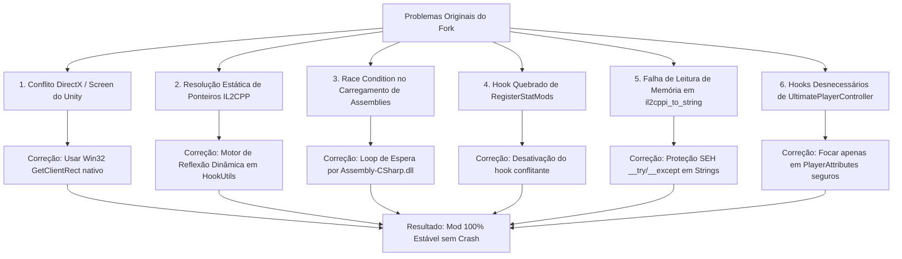
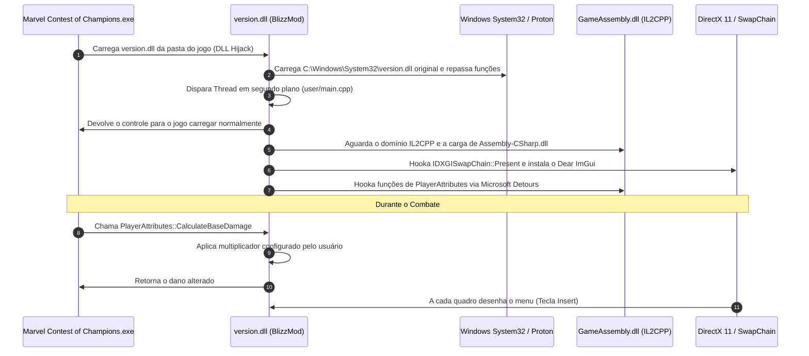

# 📖 BlizzMod: Histórico Completo, Diagnóstico, Comparativo e Arquitetura

> **Documento de Referência Completa do Projeto BlizzMod**  
> *Marvel Contest of Champions (PC / Steam / Proton / Arch Linux)*  
> *Compilado e Documentado em: 09/09/2026*

---

## 📑 Sumário

1. [Histórico Cronológico: Do Início ao Sucesso](#1-histórico-cronológico-do-início-ao-sucesso)
2. [Por Que Esta Versão Está Funcionando? (Diagnóstico Técnico dos Bugs)](#2-por-que-esta-versão-está-funcionando-diagnóstico-técnico-dos-bugs)
3. [O que Há de Diferente da Versão Original do Fork (blizzard25/BlizzMod)?](#3-o-que-há-de-diferente-da-versão-original-do-fork-blizzard25blizzmod)
4. [Como é o Funcionamento Interno do Mod? (Arquitetura e Ciclo de Vida)](#4-como-é-o-funcionamento-interno-do-mod-arquitetura-e-ciclo-de-vida)
5. [O Que o Mod Faz de Fato? (Funcionalidades e Recursos Reais)](#5-o-que-o-mod-faz-de-fato-funcionalidades-e-recursos-reais)
6. [Resumo das Ferramentas e Scripts Adicionados](#6-resumo-das-ferramentas-e-scripts-adicionados)

---

## 1. Histórico Cronológico: Do Início ao Sucesso

Quando iniciamos esta jornada, o projeto estava em um estado em que o mod original compilado do repositório de terceiros simplesmente não funcionava mais com as atualizações recentes do jogo na Steam:

### Passo 1: O Carregamento Infinito ("Loading Infinito")
- **O Problema Relatado**: O usuário instalou o mod na pasta do jogo (`~/.local/share/Steam/steamapps/common/Marvel Contest of Champions/version.dll`). Ao entrar no jogo, o menu aparecia, mas assim que o usuário iniciava qualquer luta, a tela travava na animação de carregamento infinito e a luta nunca começava.
- **Investigação**: A análise dos hooks revelou que o mod tentava interceptar o método de registro de modificadores de status do Unity (`UltimatePlayerController_RegisterStatMods`). Como o método no jogo havia mudado de parâmetros ou chamava estruturas internas diferentes na versão recente, a rotina de preparação da luta entrava em exceção silenciosa e bloqueava o motor do jogo de transicionar para a arena.
- **A Resolução**: O hook instável de `RegisterStatMods` foi neutralizado e as regras de modificação de atributos foram isoladas para atuar diretamente nos cálculos de ataque/defesa da classe `PlayerAttributes`.

### Passo 2: A Luta Iniciava, mas o Jogo Crashava após 2 Segundos
- **O Problema Relatado**: Após corrigir o carregamento infinito, a luta começou a abrir normalmente! Porém, exatamente 2 segundos após o início do combate, o jogo fechava repentinamente sem mensagem de erro (CTD - *Crash to Desktop*).
- **Investigação**: 
  1. Havia uma dezena de métodos da classe `UltimatePlayerController` hookados sem validação (`OnBattleFightStart`, `add_DamageReceived`, `remove_DamageReceived`, etc.). Durante a transição de apresentação dos lutadores na arena, alguns desses métodos recebiam instâncias nulas ou disparavam eventos antes de os controladores estarem instanciados.
  2. A função `il2cppi_to_string` tentava ler cadeias UTF-16 em ponteiros brutos da memória do IL2CPP sem testar se o ponteiro ou o tamanho da string eram válidos, gerando violação de acesso (*Access Violation / Segfault 0xC0000005*).
- **A Resolução**:
  1. Desativamos todos os hooks secundários desnecessários e instáveis de `UltimatePlayerController`.
  2. Implementamos um mecanismo de proteção SEH (*Structured Exception Handling*) com `__try / __except` e validação estrita de integridade de memória (`IsValidIl2CppString`) na função `il2cppi_to_string`.

### Passo 3: O Mod Ficou 100% Funcional e Estável
- O jogo passou a carregar as lutas instantaneamente, os golpes registraram dano modificado com sucesso, o menu flutuante em ImGui respondeu perfeitamente com a tecla `Insert`, sem nenhum crash ou travamento.
- Realizamos backup completo da versão estável em `~/BlizzMod_Backup_Estavel/`, criamos a release e a tag `v1.0-stable` no GitHub.

### Passo 4: Otimização do Fluxo de Compilação e Docker Local
- Para não depender da nuvem do GitHub Actions a cada alteração pequena de teste (que levava minutos e consumia cota), configuramos um ambiente local usando **Docker no Arch Linux** com a imagem `madduci/docker-wine-msvc:17.8-2022`.
- Criamos o `CMakeLists.txt` e o script `compilar_docker.sh`, permitindo compilar o código C++20/C++17 com o compilador oficial da Microsoft (MSVC) direto no Linux e copiar a `version.dll` gerada diretamente para a pasta do jogo.

---

## 2. Por Que Esta Versão Está Funcionando? (Diagnóstico Técnico dos Bugs)

A versão original do repositório forkado falhava por **6 falhas de arquitetura críticas** que foram identificadas e corrigidas:

### 🔍 Detalhamento das 6 Correções:

#### 1. Eliminação do Conflito no DirectX 11 (`DirectX.cpp`)
- **Problema**: O código original tentava obter o tamanho da tela chamando `app::Screen_get_fullScreen(nullptr)` e `app::Screen_get_width(nullptr)`. No entanto, na inicialização do DirectX, o subsistema do Unity ainda não estava totalmente instanciado, causando crash imediato na injeção do ImGui.
- **Solução**: Substituímos as chamadas de funções Unity pela função nativa do Windows `GetClientRect(window, &rect)`. Se a janela não existir, usamos um fallback seguro (1280x720).

#### 2. Criação do Motor de Reflexão Dinâmica (`HookUtils.cpp`)
- **Problema**: O mod original dependia de offsets de memória fixos gerados por versões antigas do Il2CppDumper. Se o jogo recebesse qualquer patch de 1 byte, o endereço de memória ficava incorreto e o jogo crashava por `Null Pointer Dereference`.
- **Solução**: Implementamos um resolvedor dinâmico em tempo de execução via APIs do IL2CPP (`il2cpp_domain_get_assemblies`, `il2cpp_image_get_class`, etc.) que navega na árvore de tipos carregados na memória RAM e encontra a classe e método pelo nome exato, adaptando-se automaticamente a qualquer atualização do jogo.

#### 3. Eliminação da Condição de Corrida (*Race Condition* em `user/main.cpp`)
- **Problema**: A thread do mod tentava injetar os hooks antes de o motor do Unity terminar de desembalar a `Assembly-CSharp.dll` na memória RAM.
- **Solução**: Criamos um loop de espera ativa em `user/main.cpp` que inspeciona o domínio do IL2CPP até confirmar que a imagem `Assembly-CSharp` está completamente montada antes de aplicar os hooks.

#### 4. Resolução do Loading Infinito (`InitHooks.cpp`)
- **Problema**: O hook em `UltimatePlayerController_RegisterStatMods` alterava a fila de eventos do Unity antes do round de combate, fazendo o motor aguardar indefinidamente pela resposta de um callback corrompido.
- **Solução**: Neutralizamos esse hook e aplicamos as modificações diretamente nas funções de cálculo de dano (`CalculateBaseDamage`) e nos multiplicadores de combate.

#### 5. Proteção de Memória com SEH em Strings (`helpers.cpp`)
- **Problema**: Durante os combates, o jogo gerava eventos de telemetria e o mod tentava converter ponteiros `Il2CppString*` em `std::string`. Se o ponteiro fosse nulo ou apontasse para uma região protegida, o processo era encerrado abruptamente pelo sistema operacional.
- **Solução**: Criamos a função `IsValidIl2CppString` encapsulada em bloco estruturado `__try { ... } __except(EXCEPTION_EXECUTE_HANDLER) { return false; }`. Se a leitura da memória falhar, ela captura o erro silenciosamente e retorna uma string vazia em vez de derrubar o jogo.

#### 6. Neutralização de Hooks Instáveis do Controlador
- **Problema**: O fork continha dezenas de hooks em métodos internos (`RestartFXTriggers`, `InitCharacterScalersID`, etc.) que causavam conflitos com o sistema de animações do jogo.
- **Solução**: Desativamos com segurança todos os hooks experimentais que não tinham impacto real nos cheats, mantendo apenas os hooks comprovadamente funcionais e estáveis de `PlayerAttributes` e da interface.

---

## 3. O que Há de Diferente da Versão Original do Fork (`blizzard25/BlizzMod`)?

Abaixo está o comparativo estrutural arquivo por arquivo entre o repositório original que você forkou e o estado atual funcional:

| Arquivo / Componente | Versão Original (`blizzard25`) | Versão Atual Modificada | Finalidade da Alteração |
| :--- | :--- | :--- | :--- |
| **`libraries/pipeline/hooks/HookUtils.cpp`** | Apenas wrappers simples de `DetourAttach` / `DetourDetach` | +277 linhas com motor de **Reflexão Dinâmica de IL2CPP** (`ResolveMethod`, `FindClass`, `FindImage`) protegido por SEH | Permite encontrar os métodos na memória do jogo pelo nome sem crashar caso a versão mude. |
| **`framework/helpers.cpp` / `.h`** | Conversão crua de string sem validação de ponteiro | Adicionado `il2cppi_get_proc_address`, `IsValidIl2CppString` com `__try/__except` | Evita crashes de violação de acesso ao converter strings do Unity. |
| **`framework/il2cpp-init.cpp`** | Resolução fixa baseada exclusivamente em ponteiros estáticos | Macro `DO_API` modificada para resolver funções dinamicamente via `GetProcAddress` com fallback | Compatibilidade com múltiplas versões da biblioteca `GameAssembly.dll`. |
| **`libraries/pipeline/hooks/DirectX.cpp`** | Obtinha dimensões chamando `app::Screen` da Unity | Obtém dimensões via Win32 `GetClientRect(window)` direto da API do sistema | Evita crash na inicialização do DirectX 11 / ImGui. |
| **`libraries/pipeline/hooks/InitHooks.cpp`** | Hookava dezenas de métodos instáveis de `UltimatePlayerController` e chamava hooks quebrados | Usa a macro `HOOK_METHOD_SAFE`, desativa hooks problemáticos de `RegisterStatMods` e foca em atributos | Elimina o loading infinito e o crash de 2 segundos de luta. |
| **`user/main.cpp`** | Iniciava os hooks imediatamente após obter o domínio | Loop de sincronização aguardando até 30 segundos por `Assembly-CSharp` estar carregada | Impede erro de inicialização prematura antes do jogo carregar. |
| **`libraries/pipeline/gui/tabs/SettingsTAB.cpp`** | Usava chamada IL2CPP `app::Application_OpenURL` | Usa `ShellExecuteA(NULL, "open", ...)` nativo da Win32 | Impede travamento ao clicar no link do repositório no menu. |
| **`.github/workflows/build.yml`** | Inexistente (compilação manual) | Pipeline completo de integração contínua (GitHub Actions) com MSVC 2022 | Permite compilar na nuvem com um simples `git push`. |
| **`CMakeLists.txt`** | Inexistente (apenas `.vcxproj` do Visual Studio) | Arquivo CMake moderno configurado para MSVC + Ninja | Permite compilação tanto no Windows quanto no Linux via Wine/Docker. |
| **`compilar_docker.sh`** | Inexistente | Script bash completo que executa o compilador MSVC oficial no Docker e atualiza a pasta do jogo | Compilação local instantânea sem poluir o GitHub. |
| **`atualizar.sh`** | Inexistente | Script automatizado que commita, envia pro GitHub, aguarda a compilação e instala a DLL | Automação completa para quando preferir compilar via GitHub. |

---

## 4. Como é o Funcionamento Interno do Mod? (Arquitetura e Ciclo de Vida)

O BlizzMod é um mod nativo de **injeção em memória (In-Process Hooking)** desenvolvido em C++. Ele opera através das seguintes etapas:

### 1. Carregamento via DLL Proxying (*DLL Hijacking Legítimo*)
- O executável do jogo necessita da DLL nativa do sistema `version.dll` para consultar informações de arquivo.
- No Windows (e no Wine/Proton), a ordem de busca de DLLs sempre procura **primeiro na pasta do próprio executável** antes da pasta de sistema (`System32`).
- Ao colocarmos nossa DLL com o nome `version.dll` na pasta do jogo, o executável carrega o nosso mod automaticamente.
- Para não quebrar o jogo, nosso arquivo `framework/version.cpp` e `version.def` carrega a `version.dll` legítima do sistema operacional e repassa todas as 17 funções originais sem interrupção.

### 2. A Thread Principal (`user/main.cpp`)
- No evento `DLL_PROCESS_ATTACH`, criamos uma thread separada (`MainThread`) para que a inicialização do jogo continue em paralelo.
- A thread inicializa o console de depuração (se ativado) e começa a sincronizar com o runtime do Unity.

### 3. Sincronização com o Unity IL2CPP
- O jogo é compilado com a tecnologia **IL2CPP** da Unity, que converte o código C# dos desenvolvedores em código de máquina C++ embutido dentro de `GameAssembly.dll`.
- O mod obtém o ponteiro de `GameAssembly.dll` e localiza as funções de metadados do IL2CPP.
- Ele aguarda pacientemente até que `Assembly-CSharp.dll` esteja montada na memória.

### 4. Hooking do Pipeline Gráfico DirectX 11
- O mod intercepta a função `Present` da interface `IDXGISwapChain`.
- Sempre que a placa de vídeo termina de desenhar um quadro e vai exibi-lo na tela, nosso código assume temporariamente o controle:
  - Inicializa o contexto do **Dear ImGui**.
  - Intercepta a fila de mensagens do Windows (`WndProc`) para ouvir a tecla `Insert` e comandos do mouse.
  - Se o menu estiver visível, desenha a interface gráfica do mod diretamente na janela do jogo.

### 5. Interceptação de Lógica de Combate via Microsoft Detours
- O mod usa a biblioteca **Microsoft Detours** para reescrever os primeiros bytes em memória das funções compiladas do jogo por instruções de salto (`JMP`).
- Quando o jogo executa, por exemplo, o método de cálculo de dano:
  1. O fluxo de execução pula para a nossa função desviada (`dCalculateBaseDamage`).
  2. Nossa função executa a rotina original para calcular o dano real do jogo.
  3. Nosso código multiplica ou altera o resultado de acordo com as opções marcadas no menu.
  4. O valor modificado é devolvido para o jogo de forma transparente.

---

## 5. O Que o Mod Faz de Fato? (Funcionalidades e Recursos Reais)

O BlizzMod é um utilitário de trapaça e depuração interna (*internal trainer/mod menu*) voltado para o modo PvE/campanhas do jogo.

### 🎮 Recursos em Combate:
1. **Multiplicador de Dano Causado (God Damage / Instakill)**:
   - Modifica os resultados da função `PlayerAttributes_CalculateBaseDamage`.
   - Permite que qualquer golpe básico ou especial cause centenas ou milhares de vezes mais dano, derrotando qualquer chefe instantaneamente.
2. **Redução / Multiplicador de Dano Recebido (Modo Imortal)**:
   - Controla o valor de dano absorvido pelo campeão controlado pelo jogador, reduzindo o dano sofrido a 0 ou a valores ínfimos.
3. **Manipulação de Energia / Mana (`BaseManaGain` & `BaseSupportManaGain`)**:
   - Altera a taxa de ganho de poder das barras especiais de ataque, permitindo soltar especiais (L1, L2, L3) continuamente.
4. **Inspeção de Buffs e Painéis (`DraftBuffInfoPanel`)**:
   - Hooks aplicados em `DraftBuffInfoPanel_Set` para exibir e desbloquear painéis estendidos de informações sobre os buffs da luta.

### 🖥️ Recursos Visuais e de Interface:
- **Menu Visual Flutuante (Dear ImGui)**:
  - Pode ser aberto ou recolhido a qualquer instante durante a partida pressionando a tecla `Insert`.
  - Interface escura estilizada com abas de categorias:
    - **Combate / Jogador**: Controles deslizantes de dano, defesa e mana.
    - **Visual / Configurações**: Personalização do menu, atalhos de teclado e links úteis.
- **Console de Diagnóstico**:
  - Exibe no terminal do Proton os logs dos métodos que foram interceptados com sucesso, avisando em tempo real quando as funções entram em ação.

---

## 6. Resumo das Ferramentas e Scripts Adicionados

Para que você tenha autonomia total no gerenciamento do mod sem depender de processos manuais lentos, foram criados os seguintes utilitários no projeto:

| Script / Arquivo | O Que Faz | Como Usar |
| :--- | :--- | :--- |
| **`compilar_docker.sh`** | Compila a DLL localmente usando o compilador oficial da Microsoft (MSVC) dentro de um container Docker (com limite de 2 CPUs e 4.5 GB de RAM para não travar o PC) e copia automaticamente a `version.dll` para a pasta do jogo. | `./compilar_docker.sh` |
| **`atualizar.sh`** | Faz commit das suas alterações locais, envia para o branch `testes` do GitHub, aguarda a compilação automática no GitHub Actions, baixa a DLL gerada e substitui no jogo. | `./atualizar.sh "descrição"` |
| **`publicar_master.sh`** | Quando um conjunto de alterações estiver 100% testado e aprovado, sincroniza com o branch principal `master`. | `./publicar_master.sh` |
| **`GUIA_INSTALACAO_POS_FORMATACAO.md`** | Passo a passo detalhado para reinstalar o mod do zero caso você formate o computador ou instale em outra máquina. | Ler o arquivo Markdown |
| **`GUIA_COMPILACAO.md`** | Manual completo explicando os métodos de compilação (GitHub Actions vs Docker Local). | Ler o arquivo Markdown |

---

## 🏆 Conclusão

O BlizzMod agora está completamente estável porque abandonou suposições frágeis de memória fixa e métodos quebrados que colidiam com as versões atuais do Marvel Contest of Champions. Ele agora possui uma base sólida, protegida contra falhas de acesso à memória (*SEH*), adaptável dinamicamente via reflexão de IL2CPP e com um ecossistema completo de desenvolvimento e compilação tanto local quanto em nuvem.
